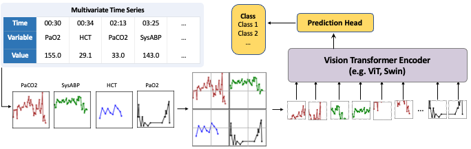
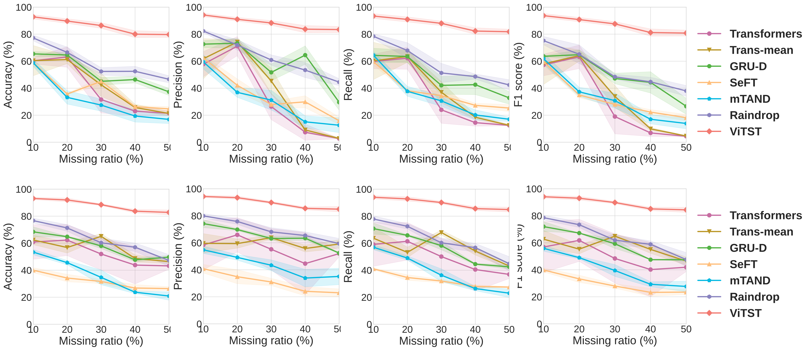

# ViTST

This is an official implementation of the NeurIPS2023 paper: "[Time Series as Images: Vision Transformer for Irregularly Sampled Time Series](https://arxiv.org/abs/2303.12799)".

## Overview
We consider the irregularly sampled multivariate time series modeling from a whole new perspective: transforming irregularly sampled time series into line graph images and adapting powerful vision transformers to perform time series classification in the same way as image classification.
With a few lines of code to transform the time series into line graph images, any vision model can be used to handle any type of time series.

<!-- ![Raindrop idea] -->
<!-- (images/fig1.png "Idea of Raindrop.") -->
<p align="center">
    
</p>

### Results
With such a simple idea, our approach significantly outperforms highly specialized SoTA algorithms:
| Methods    | P19         |           | P12         |           | PAM         |            |         |         |
|:----------:|:-----------:|:---------:|:-----------:|:---------:|:-----------:|:----------:|:-------:|:-------:|
|            | AUROC       | AUPRC     | AUROC       | AUPRC     | Accuracy    | Precision  | Recall  | F1 score|
| Transformer| 80.7±3.8    | 42.7±7.7  | 83.3±0.7    | 47.9±3.6  | 83.5±1.5    | 84.8±1.5   | 86.0±1.2| 85.0±1.3|
| Trans-mean | 83.7±1.8    | 45.8±3.2  | 82.6±2.0    | 46.3±4.0  | 83.7±2.3    | 84.9±2.6   | 86.4±2.1| 85.1±2.4|
| GRU-D      | 83.9±1.7    | 46.9±2.1  | 81.9±2.1    | 46.1±4.7  | 83.3±1.6    | 84.6±1.2   | 85.2±1.6| 84.8±1.2|
| SeFT       | 81.2±2.3    | 41.9±3.1  | 73.9±2.5    | 31.1±4.1  | 67.1±2.2    | 70.0±2.4   | 68.2±1.5| 68.5±1.8|
| mTAND      | 84.4±1.3    | 50.6±2.0  | 84.2±0.8    | 48.2±3.4  | 74.6±4.3    | 74.3±4.0   | 79.5±2.8| 76.8±3.4|
| IP-Net     | 84.6±1.3    | 38.1±3.7  | 82.6±1.4    | 47.6±3.1  | 74.3±3.8    | 75.6±2.1   | 77.9±2.2| 76.6±2.8|
| DGM^2-O    | 86.7±3.4    | 44.7±11.7 | 84.4±1.6    | 47.3±3.6  | 82.4±2.3    | 85.2±1.2   | 83.9±2.3| 84.3±1.8|
| MTGNN      | 81.9±6.2    | 39.9±8.9  | 74.4±6.7    | 35.5±6.0  | 83.4±1.9    | 85.2±1.7   | 86.1±1.9| 85.9±2.4|
| Raindrop   | 87.0±2.3    | 51.8±5.5  | 82.8±1.7    | 44.0±3.0  | 88.5±1.5    | 89.9±1.5   | 89.9±0.6| 89.8±1.0|
| **ViTST**  | **89.2±2.0**|**53.1±3.4**|**85.1±0.8**|**51.1±4.1**|**95.8±1.3**|**96.2±1.3**|**96.1±1.1**| **96.5±1.2**|

In the rigorous leave-sensors-out setting where a portion of variables is omitted during testing, our method exhibits strong robustness against varying degrees of missing observations, achieving an impressive improvement over leading specialized baselines:



*Figure: Performance in leave-**fixed**-sensors-out and leave-**random**-sensors-out settings on PAM dataset. The x-axis is the "missing ratio" which denotes the ratio of masked variables.*


## Getting Started

We conduct experiments on three irregular time series datasets P19, P12, and PAM, and several regular time series datasets from [UEA & UCR Time Series Classification Repository](http://www.timeseriesclassification.com/index.php).

### Irregular Time Series Datasets
We use the data processed by [Raindrop](https://github.com/mims-harvard/Raindrop). 

The raw data can be found at:

**(1)** P19: https://physionet.org/content/challenge-2019/1.0.0/

**(2)** P12: https://physionet.org/content/challenge-2012/1.0.0/

**(3)** PAM: http://archive.ics.uci.edu/ml/datasets/pamap2+physical+activity+monitoring

The processed datasets can be obtained at:

**(1)** P19 (PhysioNet Sepsis Early Prediction Challenge 2019) https://doi.org/10.6084/m9.figshare.19514338.v1

**(2)** P12 (PhysioNet Mortality Prediction Challenge 2012) https://doi.org/10.6084/m9.figshare.19514341.v1

**(3)** PAM (PAMAP2 Physical Activity Monitoring) https://doi.org/10.6084/m9.figshare.19514347.v1


Follow these two steps to create the images for each dataset:
1. Get the processed data, unzip them, and put the files in ```dataset``` folder.
2. Run the following commands in turn to create the images: 
   1. ```cd dataset/P12data/```, ```python ConstructImage.py```
   2. ```cd dataset/P19data/```, ```python ConstructImage.py```
   2. ```cd dataset/PAMdata/```, ```python ConstructImage.py```

**We have also provided the created images at https://drive.google.com/drive/folders/1tBkEcU9vqjbLvRqfevkbQOw4-7XcURXE?usp=drive_link**

Download the data, unzip the data, and put them in the corresponding directory.
For example, put all the directories obtained by unzipping the `P12_images.zip` under the `./datasets/P12data/processed_data/` directory.

### Regular Time Series Datasets
You can download the datasets at http://www.timeseriesclassification.com/aeon-toolkit/Archives/Multivariate2018_ts.zip. 

Create a folder ```Classification``` in the ```TSRAdara``` folder. Run ```ConstructDataset.py``` to create the images.

### Training
Before started, remember to insert your project directory into the system path by replacing the PROJECT_PATH in `sys.path.insert(0, 'PROJECT_PATH/code')` with your own project path.

For the dataset containing static features, such as P19 and P12, go to the ```code/Vision-Text/``` folder and run the script ```vtcls_script.sh``` to start training:
```
cd code/Vision-Text/
sh vtcls_script.sh
```

For the other datasets, go to the ```code/Vision/``` folder and run the script ```imgcls_script.sh``` to start training: 
```
cd code/Vision/
sh imgcls_script.sh
```

<!-- ### Self-supervised learning
If you want to self-supervised learning pretrain the model, go to the ```code/Vision/``` folder and run the script ```imgmim_script.sh``` to start training: 
```
cd code/Vision/
sh imgmim_script.sh
``` -->

### Run baseline methods
We use the code provided by [Raindrop](https://github.com/mims-harvard/Raindrop). The code for the following baseline methods are placed in ```dataset/raindrop``` folder: Transformer, Trans-mean, GRU-D, SeFT and mTAND. See details of these baselines in our paper. 

Starting from root directory ```dataset/raindrop```, you can run models as follows:

- Raindrop
```
python Raindrop.py
```

- Transformer
```
cd baselines
python Transformer_baseline.py
```

- Trans-mean
```
cd baselines
python Transformer_baseline.py --imputation mean
```

- GRU-D
```
cd baselines
python GRU-D_baseline.py
```

- SeFT
```
cd baselines
python SEFT_baseline.py
```

- mTAND
```
cd baselines/mTAND
python mTAND_baseline.py
```

- IP-Net
```
cd baselines/IP_Net/src
python IP_Net_baseline.py
```

- MTGNN
```
cd baselines
python MTGNN_baseline.py
```

- DGM2-O
```
cd baselines
python DGM2_baseline.py
```

<!-- ## Acknowledgement

We appreciate Huggingface and the following github repo very much for the valuable code base and datasets:

https://github.com/mims-harvard/Raindrop

https://github.com/gzerveas/mvts_transformer
 -->

### Citations
if you found this repo useful, please consider citing our paper:
```
@article{li2023time,
  title={Time Series as Images: Vision Transformer for Irregularly Sampled Time Series},
  author={Li, Zekun and Li, Shiyang and Yan, Xifeng},
  journal={arXiv preprint arXiv:2303.12799},
  year={2023}
}
```